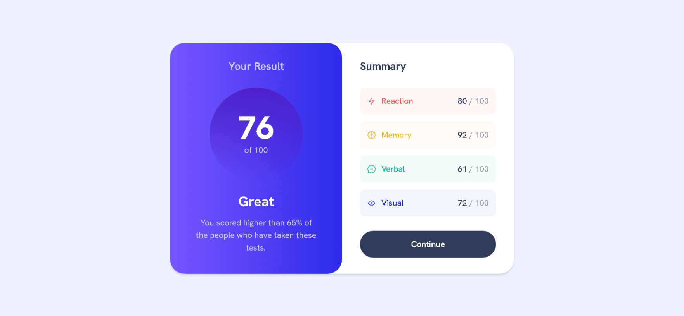

# Frontend Mentor - Results Summary Component Solution

This is a solution to the [Results summary component challenge on Frontend Mentor](https://www.frontendmentor.io/challenges/results-summary-component-CE_K6s0maV). Frontend Mentor challenges help you improve your coding skills by building realistic projects.

## Table of contents

- [Frontend Mentor - Results Summary Component Solution](#frontend-mentor---results-summary-component-solution)
  - [Table of contents](#table-of-contents)
  - [Overview](#overview)
    - [The challenge](#the-challenge)
    - [Screenshot](#screenshot)
  - [Links](#links)
  - [My process](#my-process)
    - [Built with](#built-with)
    - [What I learned](#what-i-learned)
    - [Continued development](#continued-development)
    - [Useful resources](#useful-resources)
  - [Author](#author)
  - [Acknowledgments](#acknowledgments)

## Overview

### The challenge

Users should be able to:

- View the optimal layout for the interface depending on their device's screen size
- See hover and focus states for all interactive elements on the page
- **Bonus**: Use the local JSON data to dynamically populate the content

### Screenshot



## Links

- Solution URL: [Checkout the solution on frontend mentor](https://www.frontendmentor.io/solutions/results-summary-component-I_hCcTgkyw)
- Live Site URL: [Checkout the live preview](https://results-summary-component-bice-ten.vercel.app/)

## My process

### Built with

- Semantic HTML5 markup
- CSS custom properties
- Flexbox
- CSS Grid
- Mobile-first workflow
- [React](https://reactjs.org/)
- [Next.js](https://nextjs.org/)
- [Styled Components](https://styled-components.com/)

### What I learned

This project helped reinforce my understanding of responsive layouts, accessibility through focus states, and dynamic rendering of JSON content using React.

```html
<h1>Clean and semantic markup</h1>
```

```css
.summary-box {
  background: var(--gradient-light);
  border-radius: 1rem;
}
```

```js
const loadSummaryData = async () => {
  const response = await fetch('/data.json');
  const data = await response.json();
  setSummary(data);
}
```

### Continued development

In future projects, I want to continue improving my grasp of accessibility features, animations for transitions between layout states, and working with styled-components in larger-scale apps.

### Useful resources

- [CSS Tricks - A Complete Guide to Flexbox](https://css-tricks.com/snippets/css/a-guide-to-flexbox/)
- [MDN Web Docs - Grid Layout](https://developer.mozilla.org/en-US/docs/Web/CSS/CSS_Grid_Layout)
- [Frontend Mentor Community](https://www.frontendmentor.io)

## Author

- Website - [Fawaz Iwalewa](https://iwaola.me)
- Frontend Mentor - [@fawaziwalewa](https://www.frontendmentor.io/profile/fawaziwalewa)
- Twitter - [@IwalewaFawaz](https://www.twitter.com/IwalewaFawaz)

## Acknowledgments

Shoutout to the Frontend Mentor community for their awesome feedback and code inspiration!
